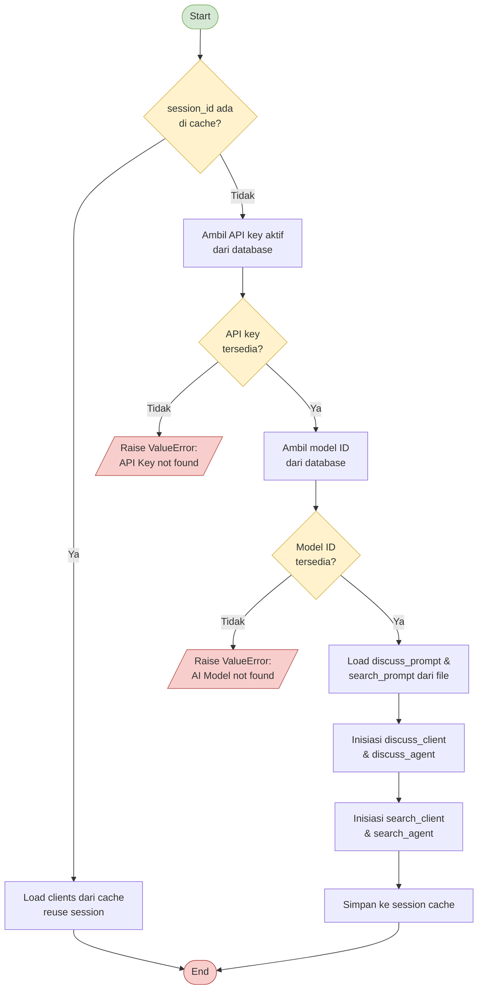
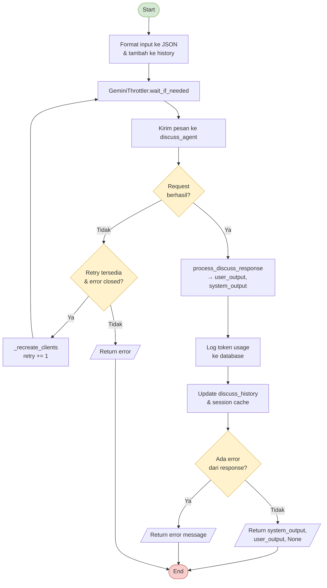
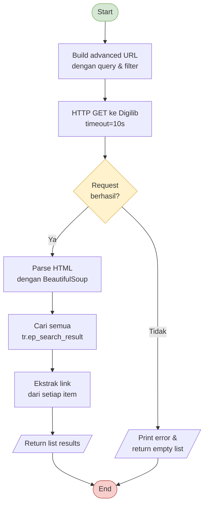
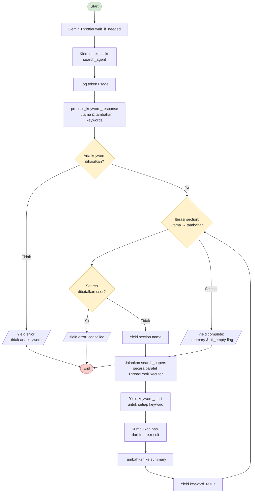
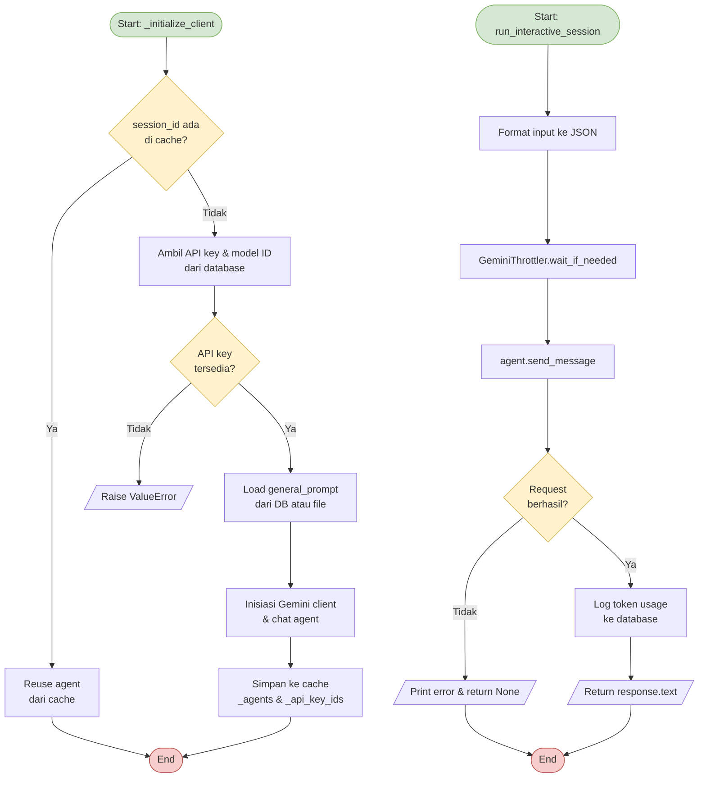
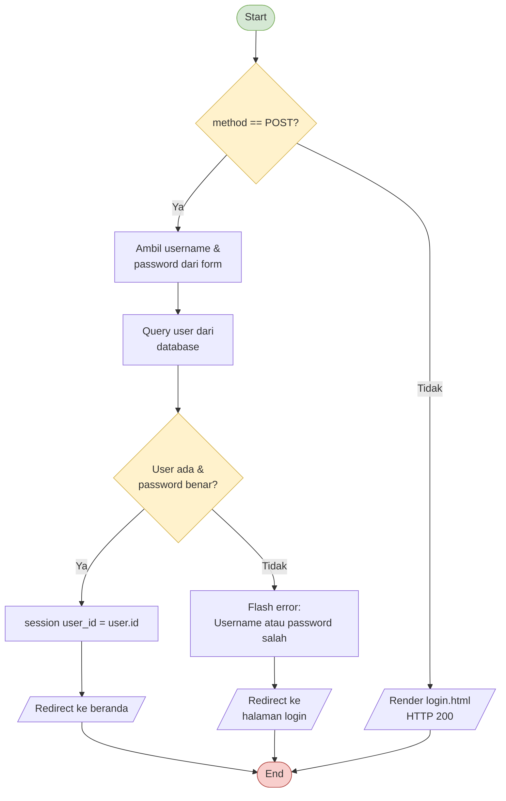
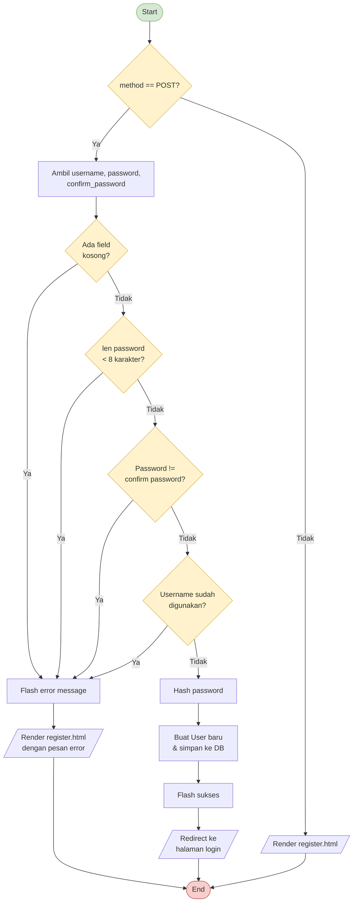
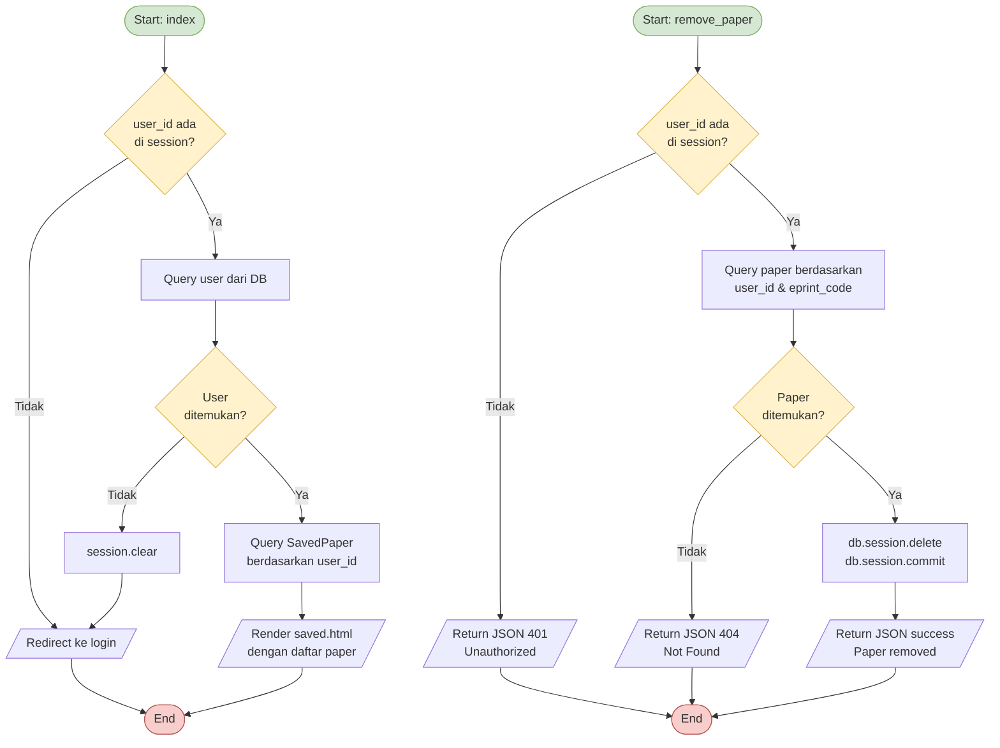
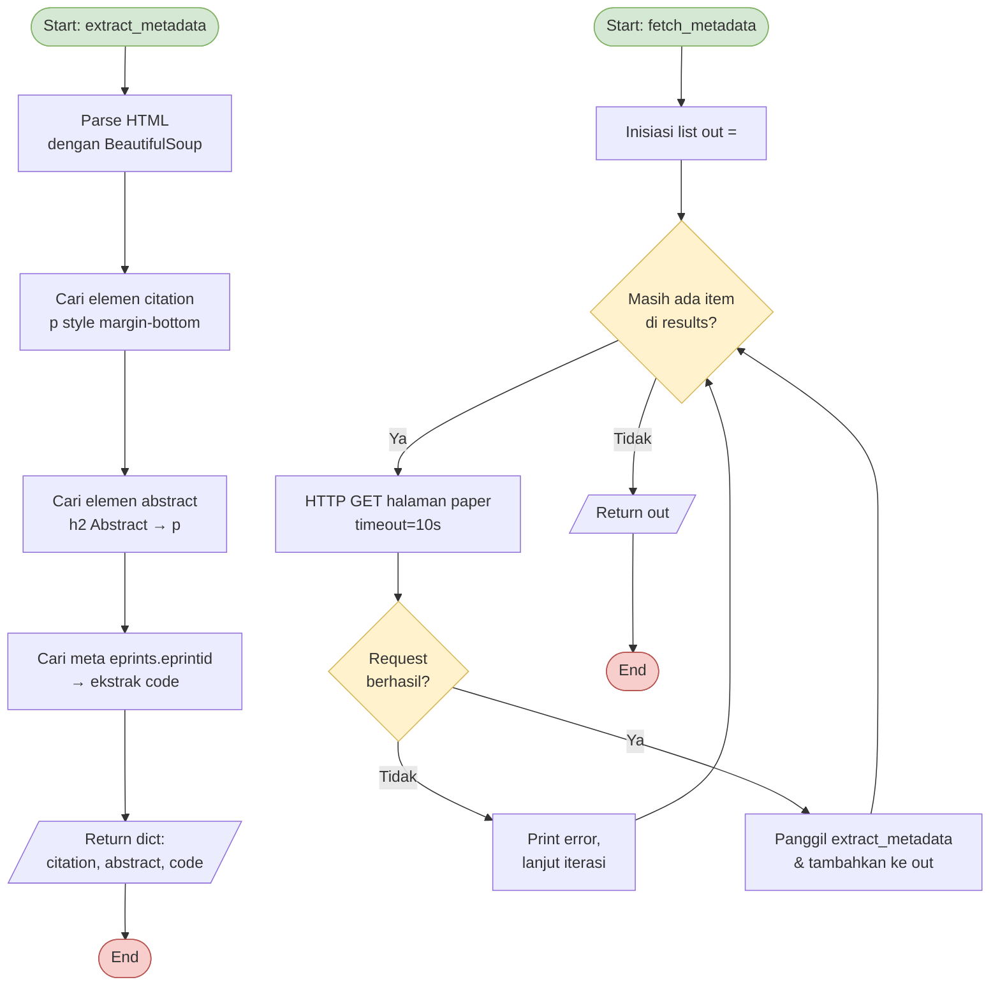

# White Box Testing — Viorama.site

Pengujian White Box Testing dilaksanakan menggunakan metode Unit Testing terhadap enam modul utama sistem. Setiap fungsi inti pada masing-masing modul diuji secara independen dengan menyusun skenario test case berdasarkan kelas masukan valid dan tidak valid, sehingga setiap fungsi dapat diverifikasi kesesuaiannya dengan spesifikasi yang telah ditetapkan. Total terdapat 14 skenario test case yang dirancang dalam pengujian White Box Testing ini.

---

## Tabel 1 — Skenario Pengujian Discuss Agent Module

| No | Modul | Fungsi | Kelas Input | Output yang Diharapkan |
|----|-------|--------|-------------|----------------------|
| 1 | Discuss Agent | `_initialize_clients()` | API key valid | Klien Discuss Agent dan Search Agent berhasil diinisiasi |
| 2 | Discuss Agent | `run_interactive_session()` | Pertanyaan pengguna tentang topik KTI | Dialog diproses, user intent teridentifikasi, respons dikirim ke Search Agent |

### Alur Fungsi: `_initialize_clients()`



### Alur Fungsi: `run_interactive_session()`



### Kode Fungsi

```python
# app/gemini_client/searching_v2.py

def _initialize_clients(self):
    if self.session_id in self._sessions:
        data = self._sessions[self.session_id]
        self.discuss_client = data['discuss_client']
        self.search_client  = data['search_client']
        self.discuss_agent  = data['discuss_agent']
        self.search_agent   = data['search_agent']
        self.discuss_history = data['discuss_history']
        self.api_key_id = self._api_key_ids.get(self.session_id)
        return

    self.api_key = self._get_active_api_key()
    if not self.api_key:
        raise ValueError("Active API Key not found in database (APIKey table)")

    model_id = self._get_active_model_id()
    if not model_id:
        raise ValueError("Active AI Model not found in database (AIModel table)")

    discuss_prompt = self._load_prompt('app/prompts/discuss_client_v2.txt')
    search_prompt  = self._load_prompt('app/prompts/search_client_v2.txt')

    self.discuss_client = genai.Client(api_key=self.api_key)
    self.discuss_agent  = self.discuss_client.chats.create(
        model=model_id,
        config=types.GenerateContentConfig(system_instruction=discuss_prompt),
    )
    self.search_client = genai.Client(api_key=self.api_key)
    self.search_agent  = self.search_client.chats.create(
        model=model_id,
        config=types.GenerateContentConfig(system_instruction=search_prompt),
    )
    self.discuss_history = []
    self._sessions[self.session_id] = {
        'discuss_client': self.discuss_client,
        'search_client':  self.search_client,
        'discuss_agent':  self.discuss_agent,
        'search_agent':   self.search_agent,
        'discuss_history': self.discuss_history,
    }
    self._api_key_ids[self.session_id] = self.api_key_id


def run_interactive_session(self, user_input):
    max_retries = 2
    retry = 0
    last_err = ""
    while retry < max_retries:
        try:
            formatted = json.dumps(
                [{"role": "user", "input": user_input}], indent=4, ensure_ascii=False)
            self.discuss_history.append({"role": "user", "content": user_input})
            from app.gemini_client.throttler import GeminiThrottler
            GeminiThrottler.wait_if_needed()
            response = self.discuss_agent.send_message(formatted)
            user_output, system_output, error = self.process_discuss_response(response.text)
            try:
                from app.gemini_client.usage_logger import log_token_usage_sync
                usage = response.usage_metadata
                if usage and self.api_key_id:
                    log_token_usage_sync(
                        api_key_id=self.api_key_id,
                        input_tokens=usage.prompt_token_count or 0,
                        output_tokens=usage.candidates_token_count or 0,
                        session_id=self.session_id, feature='discuss_v2',
                        input_content=user_input,
                        output_content=user_output if user_output else response.text,
                    )
            except Exception as log_err:
                print(f"[SearchV2] usage log error: {log_err}")
            self.discuss_history.append({
                "role": "assistant",
                "content": user_output if user_output else response.text,
            })
            self._update_session_cache()
            if error:
                return "", f"Error processing response: {error}", error
            return system_output or "", user_output or "", None
        except Exception as e:
            last_err = str(e)
            if "closed" in last_err.lower() and retry < max_retries - 1:
                try:
                    self._recreate_clients(); retry += 1; continue
                except Exception as rec_err:
                    print(f"[SearchV2] recreate error: {rec_err}"); break
            break
    return "", f"An error occurred: {last_err}", last_err
```

---

## Tabel 2 — Skenario Pengujian Search Agent Module

| No | Modul | Fungsi | Kelas Input | Output yang Diharapkan |
|----|-------|--------|-------------|----------------------|
| 3 | Search Agent | `search_repository()` | Query kata kunci valid | Daftar hasil pencarian dari repositori Digilib dikembalikan |
| 4 | Search Agent | `search_papers()` | Deskripsi topik pencarian valid | Daftar paper relevan beserta metadata dikembalikan |
| 5 | Search Agent | `process_keyword_search()` | Deskripsi pencarian dan chat_id valid | Keyword diproses, hasil pencarian di-inject ke konteks respons |

### Alur Fungsi: `search_repository()`



### Alur Fungsi: `process_keyword_search()`



### Kode Fungsi

```python
# app/gemini_client/searching_v2.py

def search_repository(self, query, max_results=None, filters=None):
    filters = filters or {}
    paper_type = filters.get('paper_type') or filters.get('thesis_type')
    url = self._build_advanced_url(query,
        date_from=filters.get('date_from'), date_to=filters.get('date_to'),
        paper_type=paper_type)
    try:
        r = requests.get(url, timeout=10)
        r.raise_for_status()
        soup = BeautifulSoup(r.text, 'html.parser')
        results = []
        items = soup.find_all('tr', class_='ep_search_result')
        iterable = items if max_results is None else items[:max_results]
        for item in iterable:
            a = item.find('a', href=True)
            if a:
                link = urllib.parse.urljoin(self.BASE_URL, a['href'])
                results.append({"link": link})
        return results
    except requests.RequestException as e:
        print(f"[SearchV2] Repository search error for '{query}': {e}")
        return []

def search_papers(self, query, filters=None):
    results = self.search_repository(query, filters=filters)
    if not results:
        return []
    return self.fetch_metadata(results)

def process_keyword_search(self, user_description, chat_id=None, app_context=None, filters=None):
    try:
        from app.gemini_client.throttler import GeminiThrottler
        GeminiThrottler.wait_if_needed()
        agent_input = json.dumps(
            [{"role": "user_description", "input": user_description}],
            indent=4, ensure_ascii=False)
        response = self.search_agent.send_message(agent_input)
        try:
            from app.gemini_client.usage_logger import log_token_usage_sync
            usage = response.usage_metadata
            if usage and self.api_key_id:
                log_token_usage_sync(
                    api_key_id=self.api_key_id,
                    input_tokens=usage.prompt_token_count or 0,
                    output_tokens=usage.candidates_token_count or 0,
                    session_id=self.session_id, feature='search_v2',
                    input_content=user_description, output_content=response.text)
        except Exception as log_err:
            print(f"[SearchV2] keyword usage log error: {log_err}")
        keywords = self.process_keyword_response(response.text)
        utama    = keywords.get("utama", [])
        tambahan = keywords.get("tambahan", [])
        if not utama and not tambahan:
            yield {"error": "Search agent tidak menghasilkan kata kunci."}
            return
        summary = []
        had_any_result = False
        for section_name, kw_list in [("utama", utama), ("tambahan", tambahan)]:
            if not kw_list: continue
            if AcademicSearchSystemV2.is_cancelled(self.session_id):
                yield {"error": "Search cancelled by user"}; return
            yield {"section": section_name}
            workers = min(KEYWORD_PARALLEL_WORKERS, len(kw_list))
            with ThreadPoolExecutor(max_workers=workers, thread_name_prefix='kw-search') as executor:
                futures = [executor.submit(self.search_papers, kw, filters) for kw in kw_list]
                for kw, future in zip(kw_list, futures):
                    if AcademicSearchSystemV2.is_cancelled(self.session_id):
                        for f in futures: f.cancel()
                        yield {"error": "Search cancelled by user"}; return
                    yield {"keyword_start": {"keyword": kw, "kw_type": section_name}}
                    try:
                        results = future.result()
                    except Exception as kw_err:
                        print(f"[SearchV2] keyword '{kw}' error: {kw_err}"); results = []
                    if results: had_any_result = True
                    summary.append({"keyword": kw, "kw_type": section_name,
                                    "count": len(results), "results": results})
                    yield {"keyword_result": {"keyword": kw, "kw_type": section_name,
                                              "count": len(results), "results": results}}
        yield {"complete": True, "all_empty": (not had_any_result), "summary": summary}
    except Exception as e:
        import traceback; traceback.print_exc()
        yield {"error": str(e)}
```

---

## Tabel 3 — Skenario Pengujian General Agent Module

| No | Modul | Fungsi | Kelas Input | Output yang Diharapkan |
|----|-------|--------|-------------|----------------------|
| 6 | General Agent | `_initialize_client()` | API key valid | Klien General Agent berhasil diinisiasi |
| 7 | General Agent | `run_interactive_session()` | Pertanyaan tentang layanan perpustakaan | Respons berisi informasi layanan perpustakaan yang relevan |

### Alur Fungsi: `_initialize_client()` & `run_interactive_session()`



### Kode Fungsi

```python
# app/gemini_client/general_knowledge.py

def _initialize_client(self):
    if self.session_id in GeneralKnowledgeSystem._agents:
        self.agent = GeneralKnowledgeSystem._agents[self.session_id]
        self.api_key_id = GeneralKnowledgeSystem._api_key_ids.get(self.session_id)
        return
    self.api_key = self._get_active_api_key()
    if not self.api_key:
        raise ValueError("Active API Key not found in database (APIKey table)")
    model_id    = self._get_active_model_id()
    prompt_text = self._get_db_setting('general_prompt')
    if not prompt_text:
        prompt_text = self._load_prompt('app/prompts/base_information.txt')
    self.client = genai.Client(api_key=self.api_key)
    self.agent  = self.client.chats.create(
        model=model_id,
        config=types.GenerateContentConfig(system_instruction=prompt_text))
    GeneralKnowledgeSystem._agents[self.session_id]      = self.agent
    GeneralKnowledgeSystem._api_key_ids[self.session_id] = self.api_key_id

def run_interactive_session(self, user_input):
    try:
        formatted_input = json.dumps(
            [{"role": "user", "input": user_input}], indent=4, ensure_ascii=False)
        from app.gemini_client.throttler import GeminiThrottler
        GeminiThrottler.wait_if_needed()
        response = self.agent.send_message(formatted_input)
        try:
            from app.gemini_client.usage_logger import log_token_usage_sync
            usage_meta = response.usage_metadata
            if usage_meta and self.api_key_id:
                log_token_usage_sync(
                    api_key_id=self.api_key_id,
                    input_tokens=usage_meta.prompt_token_count or 0,
                    output_tokens=usage_meta.candidates_token_count or 0,
                    session_id=self.session_id, feature='general',
                    input_content=user_input, output_content=response.text)
        except Exception as log_err:
            print(f"[GeneralKnowledge] Could not log usage: {log_err}")
        return response.text
    except Exception as e:
        print(f"Error in interactive session for session {self.session_id}: {e}")
        return None
```

---

## Tabel 4 — Skenario Pengujian Authentication Module

| No | Modul | Fungsi | Kelas Input | Output yang Diharapkan |
|----|-------|--------|-------------|----------------------|
| 8 | Authentication | `login()` | Username dan password valid | Session user_id tersimpan, redirect ke halaman beranda |
| 9 | Authentication | `login()` | Username atau password tidak valid | Flash error "Username atau password salah", redirect ke halaman login |
| 10 | Authentication | `register()` | Data registrasi lengkap dan valid | Akun baru tersimpan di database, redirect ke halaman login |

### Alur Fungsi: `login()`



### Alur Fungsi: `register()`



### Kode Fungsi

```python
# app/routes/auth.py

@bp.route('/login', methods=['GET', 'POST'])
def login():
    if request.method == 'POST':
        username = request.form.get('username')
        password = request.form.get('password')
        user = User.query.filter_by(username=username).first()
        if user and check_password_hash(user.password, password):
            session['user_id'] = user.id
            return redirect(url_for('home.home'))
        else:
            flash('Username atau password salah.', 'danger')
            return redirect(url_for('auth.login'))
    return render_template('login.html')

@bp.route('/register', methods=['GET', 'POST'])
def register():
    if request.method == 'POST':
        username = request.form.get('username')
        password = request.form.get('password')
        confirm_password = request.form.get('confirm_password')
        error = None
        if not username or not password or not confirm_password:
            error = 'Semua field wajib diisi.'
        elif len(password) < 8:
            error = 'Password minimal 8 karakter.'
        elif password != confirm_password:
            error = 'Password tidak cocok.'
        elif User.query.filter_by(username=username).first():
            error = f"Username '{username}' sudah digunakan."
        if error:
            flash(error, 'danger')
            return render_template('register.html')
        hashed_password = generate_password_hash(password, method='pbkdf2:sha256')
        new_user = User(username=username, password=hashed_password)
        db.session.add(new_user)
        db.session.commit()
        flash('Akun berhasil dibuat! Silakan masuk.', 'success')
        return redirect(url_for('auth.login'))
    return render_template('register.html')
```

---

## Tabel 5 — Skenario Pengujian Saved Paper Module

| No | Modul | Fungsi | Kelas Input | Output yang Diharapkan |
|----|-------|--------|-------------|----------------------|
| 11 | Saved Paper | `index()` | User login, terdapat paper yang telah disimpan | Halaman daftar paper tersimpan ditampilkan beserta metadata |
| 12 | Saved Paper | `remove_paper()` | Kode eprint paper valid dan milik user | Paper dihapus dari daftar tersimpan |

### Alur Fungsi: `index()` & `remove_paper()`



### Kode Fungsi

```python
# app/routes/saved.py

@bp.route('/')
def index():
    if 'user_id' not in session:
        return redirect(url_for('auth.login'))
    user = User.query.get(session['user_id'])
    if user is None:
        session.clear()
        return redirect(url_for('auth.login'))
    saved_papers = SavedPaper.query.filter_by(
        user_id=user.id).order_by(desc(SavedPaper.id)).all()
    return render_template('saved.html', user=user, saved_papers=saved_papers)

@bp.route('/remove/<string:eprint_code>', methods=['POST'])
def remove_paper(eprint_code):
    if 'user_id' not in session:
        return jsonify({'success': False, 'error': 'Unauthorized'}), 401
    paper_to_delete = SavedPaper.query.filter_by(
        user_id=session['user_id'], eprint_code=eprint_code).first()
    if not paper_to_delete:
        return jsonify({'success': False, 'error': 'Paper not found in your saved list'}), 404
    try:
        db.session.delete(paper_to_delete)
        db.session.commit()
        return jsonify({'success': True, 'message': 'Paper removed successfully.'})
    except Exception as e:
        db.session.rollback()
        return jsonify({'success': False, 'error': 'An internal error occurred.'}), 500
```

---

## Tabel 6 — Skenario Pengujian Paper Extraction Module

| No | Modul | Fungsi | Kelas Input | Output yang Diharapkan |
|----|-------|--------|-------------|----------------------|
| 13 | Paper Extraction | `extract_metadata()` | HTML halaman paper valid dari repositori Digilib | Metadata judul, abstrak, tahun, dan kode eprint berhasil diekstrak |
| 14 | Paper Extraction | `fetch_metadata()` | Daftar URL hasil pencarian valid | Metadata lengkap untuk setiap paper dalam daftar dikembalikan |

### Alur Fungsi: `extract_metadata()` & `fetch_metadata()`



### Kode Fungsi

```python
# app/gemini_client/searching_v2.py

def extract_metadata(self, html):
    soup = BeautifulSoup(html, 'html.parser')
    cite = soup.find('p', style=re.compile(r'margin-bottom:\s*1em'))
    citation = cite.get_text(strip=True) if cite else "No citation available"
    abstract = "No abstract available"
    ab_h2 = soup.find('h2', string=re.compile(r'Abstract', re.IGNORECASE))
    if ab_h2:
        ab_p = ab_h2.find_next('p')
        if ab_p:
            abstract = ab_p.get_text(strip=True)
    meta = soup.find('meta', attrs={'name': 'eprints.eprintid'})
    code = meta['content'].strip() if meta else ""
    return {"citation": citation, "abstract": abstract, "code": code}

def fetch_metadata(self, search_results):
    out = []
    for r in search_results:
        try:
            resp = requests.get(r["link"], timeout=10)
            resp.raise_for_status()
            out.append(self.extract_metadata(resp.text))
        except requests.RequestException as e:
            print(f"[SearchV2] fetch_metadata error: {e}")
            continue
    return out
```

---

## Ringkasan Hasil Pengujian White Box Testing

| No | Modul | Jumlah Fungsi Diuji | Jumlah Test Case | Valid |
|----|-------|-------------------|-----------------|
| 1 | Discuss Agent Module | 2 | 2 | 2 | 0 |
| 2 | Search Agent Module | 3 | 3 | 3 | 0 |
| 3 | General Agent Module | 2 | 2 | 2 | 0 |
| 4 | Authentication Module | 2 | 3 | 3 | 0 |
| 5 | Saved Paper Module | 2 | 2 | 2 | 0 |
| 6 | Paper Extraction Module | 2 | 2 | 2 | 0 |
| | **Total** | **13** | **14** |

Seluruh 14 skenario test case telah dirancang untuk memverifikasi kesesuaian logika internal setiap fungsi dengan spesifikasi yang ditetapkan.
